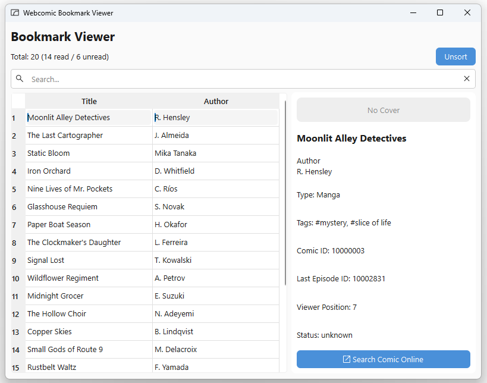

# webcomics-bookmark-viewer

A desktop app to browse and search bookmark data recovered from a
discontinued webcomic reader.



## Background
While going through old files on my phone, I found a `data.mvpref` file. It turned out to be exported bookmark data from a webcomic app I used years ago that has since shut down. Since the app no longer works, and my phone's text viewer was too slow to browse the raw file, I built a proper bookmark viewer to see what comics I had been reading and bookmarking.

## Features
- Parses an undocumented, reverse-engineered JSON bookmark schema
- Sortable, searchable table view (title, author)
- Detail panel showing tags, last-read status, and comic metadata
- One-click search for a comic online (helps with truncated titles from the original app)

## Tech Stack
Python, PySide6 (Qt), Model/View architecture

## Running Locally
This repo does not include real bookmark data.
To try the app with sample data, copy the sample file first:

```bash
git clone https://github.com/git-skc74/webcomics-bookmark-viewer.git
cd webcomics-bookmark-viewer
cp sample_data/sample.mvpref data/data.mvpref
uv sync
uv run main.py
```

## Technical Notes
See [Bookmark JSON Structure Analysis](docs/bookmark_analysis.md) for detailed analysis.

## Credits
App Icon from [Material Symbols](https://fonts.google.com/icons) (Apache License 2.0)